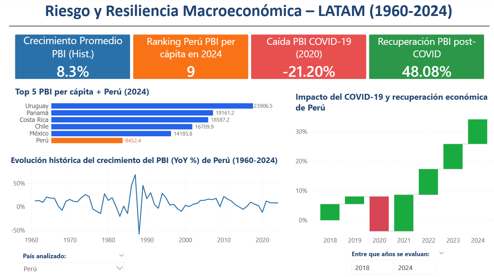

# 📊 Análisis Macroeconómico LATAM

## 🧭 Descripción General

Este proyecto consiste en el desarrollo de un dashboard interactivo enfocado en el análisis macroeconómico de países de Latinoamérica (LATAM), con especial énfasis en la evolución del Producto Bruto Interno (PBI) y el PBI per cápita.

El objetivo principal es analizar tendencias históricas, medir impactos económicos relevantes (como el COVID-19) y comparar el desempeño económico de Perú frente a la región.

El proyecto forma parte de un portafolio profesional orientado a roles de **Analista de Datos Jr.**, aplicando buenas prácticas de modelado, métricas DAX y diseño de dashboards ejecutivos.

---

## 🎯 Objetivos del Proyecto

* Analizar la evolución histórica del PBI en países LATAM.
* Comparar el crecimiento económico entre países.
* Evaluar el impacto económico del COVID-19.
* Medir la recuperación económica post-pandemia.
* Analizar el posicionamiento de Perú en la región mediante PBI per cápita.
* Diseñar visualizaciones claras orientadas a toma de decisiones.

---

## 🗂️ Fuente de Datos

Los datos fueron obtenidos mediante una **API macroeconómica internacional**, lo que permitió trabajar con información estructurada y estandarizada.

### Características del dataset:

* Datos anuales por país.
* Indicadores económicos:

  * PBI (USD).
  * PBI per cápita.
* Cobertura regional: Países de Latinoamérica.
* Horizonte temporal: Serie histórica multianual.

Debido al origen vía API, los datos presentaron un alto nivel de limpieza, reduciendo la necesidad de procesos intensivos de data wrangling.

---

## ⚙️ Proceso ETL

### 1️⃣ Extract

* Conexión a API macroeconómica.
* Descarga de indicadores por país y año.

### 2️⃣ Transform

* Estandarización de nombres de países.
* Validación de tipos de datos.
* Revisión de valores nulos.
* Modelado para análisis temporal.

### 3️⃣ Load

* Carga del dataset en Power BI.
* Creación de modelo relacional para análisis.

---

## 🧠 Métricas Clave (DAX)

### 📈 Crecimiento Promedio PBI (Hist.)

**Resultado:** 8.3%

---

### 🏆 Ranking Perú — PBI per cápita (2024)

**Resultado:** Puesto 9

---

### 📉 Caída PBI por COVID-19 (2020)

```DAX
Caída PBI COVID-19 2020 =
VAR GDP_2019 = CALCULATE(MAX([PBI (USD)]), 'Analisis Macro LATAM'[Año]=2019)
VAR GDP_2020 = CALCULATE(MAX([PBI (USD)]), 'Analisis Macro LATAM'[Año]=2020)
RETURN
(GDP_2020 - GDP_2019)/GDP_2019
```

**Resultado:** -21.20%

---

### 🚀 Recuperación PBI post-COVID (%)

**Resultado:** 48.08%

---

## 📊 Dashboard Preview



## 📊 Características del Dashboard

* Tarjetas KPI ejecutivas.
* Comparación regional por país.
* Tendencias históricas del PBI.
* Análisis del impacto COVID-19.
* Storytelling económico orientado a negocio.

---

## 🔍 Insights Destacados

* Perú mostró un crecimiento promedio histórico sólido.
* El COVID-19 generó una fuerte contracción económica.
* La recuperación post-pandemia evidenció rebote significativo.
* Perú se ubica en media tabla regional en PBI per cápita.

---

## 🛠️ Herramientas Utilizadas

* **Power BI**
* **DAX**
* **API Macroeconómica**
* **Excel / Power Query**

---

## 📌 Limitaciones

* Datos anuales agregados.
* Dependencia de la API.
* Sin variables sociales/políticas.

---

## 🚧 Mejoras Futuras

* Incluir inflación y desempleo.
* Ajuste por PPP.
* Proyecciones económicas.
* Modelos predictivos.
* Automatización vía API.

---

## 👨‍💻 Autor

**Jose Daniel Reyes Gutierrez**
Portafolio orientado a Analítica de Datos Jr.

---

## 📎 Estado del Proyecto

✅ Finalizado — Dashboard funcional y documentado.
